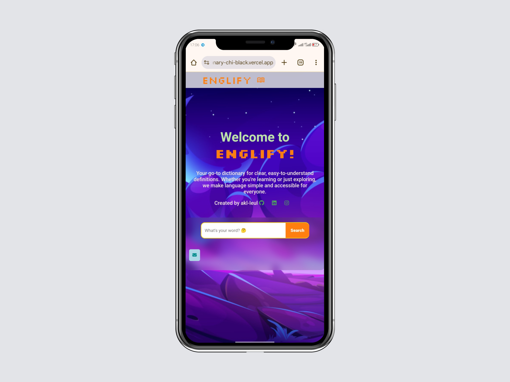
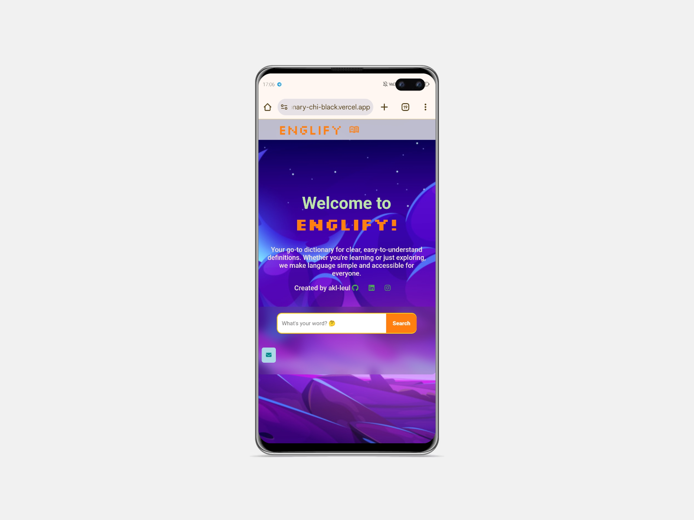

# Dictionary

**📌 Project Overview**

This is a Dictionary Website that allows users to search for word definitions, synonyms, antonyms, and pronunciations. The website is designed for a smooth and user-friendly experience, offering quick and accurate results.

**🚀 Features**

Word Search – Find meanings, synonyms, antonyms, and pronunciation.

Audio Pronunciation – Listen to the correct pronunciation of words.

Responsive Design – Works on all devices, including mobile and desktop.

Fast & Lightweight – Optimized for speed and efficiency.

**🔧 Technologies Used**

*Frontend:* HTML, CSS, JavaScript

*API Integration:* Fetches word data from a dictionary API

*Hosting:* Vercel

**Screenshots**
 

**📂 Project Structure**

/Dictionary

│── index.html         
│── style.css         
│── Script.js           
│── image/             
│── README.md          

**🎯 How to Use**

1. Open the website in a browser.

2. Enter a word in the search bar.

3. Click "Search" to see the word’s meaning, synonyms, antonyms, and pronunciation.

**⚡ Future Enhancements**

Offline Mode – Enable word lookup without an internet connection.

Multilingual Support – Provide definitions in multiple languages.

Bookmark Feature – Allow users to save words for later.

**📩 Contact**

Created by Leul Ayfokru
Email: [✉️abateisking@gmail.com](mailto:abateisking@gmail.com)
 

Let me know if you want any modifications!

